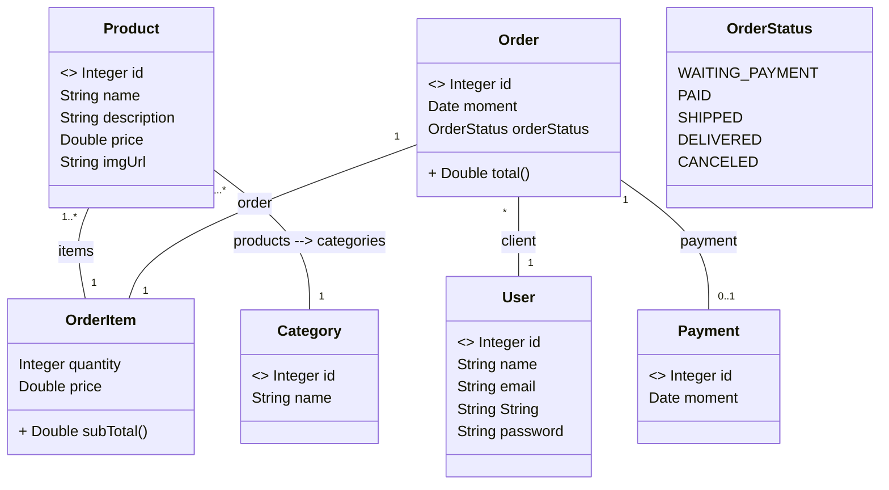

# Projeto Web Services com Spring Boot e JPA / Hibernate

## Objetivos Desse Projeto

- Criar Projeto Spring Boot Java
- Implementar Modelo de Momínio
- Estruturar Camadas Lógicas: Resource, Service, Repository
- Configurar Banco de Dados de Teste (H2)
- CRUD - Create, Retrieve, Update, Delete
- Realizar Tratamento de Exceções

## Diagrama de Classe

## Tecnologias

- Java
- Spring Boot
- Apache Tomcat
- Maven
- H2 Database
- PostgreSQL
- Heroku
- Postman
